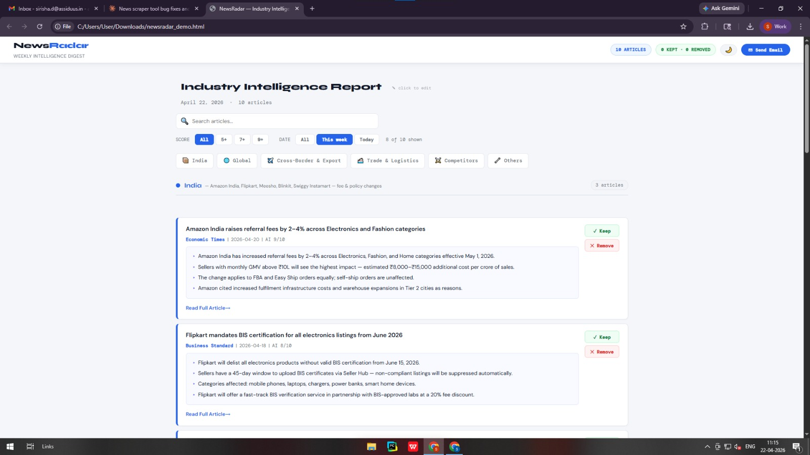

<div align="center">

# 📡 NewsRadar

### Stop reading the news. Let AI read it for you.

*Scrapes hundreds of RSS feeds · Scores every article with a local LLM · Delivers a curated interactive digest your team can review and send in one click*

<br/>

[](https://python.org)
[](https://ollama.com)
[](LICENSE)
[](#)

<br/>



<br/>

</div>

---

## 🤔 The Problem

Every industry team has the same painful morning routine:

> *Open 12 tabs. Skim 40 headlines. Most are noise — funding rounds, celebrity news, opinion pieces. Spend 45 minutes finding the 5 articles that actually matter. Forward them manually. Repeat tomorrow.*

**NewsRadar eliminates that entirely.**

---

## ⚡ What It Does in 60 Seconds

```
100+ RSS feeds fetched simultaneously
        ↓
4 filtering gates strip out noise automatically
        ↓
Local AI (no API key, no cost) scores each article 0–10 for relevance
        ↓
AI writes 4-bullet summaries of every article that passes
        ↓
Beautiful interactive report opens in your browser
        ↓
Review → reorder → remove noise → click Send
```

The whole pipeline runs **on your machine**. No cloud. No subscriptions. No data leaving your laptop.

---

## ✨ Features at a Glance

```
🏭  Multi-industry    Run --industry fintech, healthcare, tech, or ecommerce
🔍  Live search       Filter cards across all sections as you type
🎯  Smart filters     Show only AI score 7+, 9+, or articles from today
🌙  Dark mode         One click — full dark theme, looks great at night
💬  Slack digest      Auto-posts top articles to your Slack channel
↕️  Drag & drop       Reorder or move articles between categories
✏️  Editable title    Rename the report before sending
📧  One-click email   Sends a clean static digest to all recipients
📊  Excel export      Full data with AI scores exported to .xlsx
🧠  It learns         Keep/Remove clicks improve AI scoring next run
```

---

## 🚀 Get Running in 4 Steps

### 1 · Install dependencies

```bash
pip install feedparser openpyxl ollama requests python-dotenv
```

---

### 2 · Set up Ollama (your free local AI)

Download from **[ollama.com](https://ollama.com)**, install it, then:

```bash
# Terminal 1 — keep this open the whole time
ollama serve

# Terminal 2 — one-time model download (~2.5 GB)
ollama pull qwen3:4b
```

> **Why local AI?** Your news queries stay on your machine. No OpenAI bills. `qwen3:4b` scores and summarises articles in ~2 seconds each.

---

### 3 · Add your credentials

```bash
cp .env.example .env
```

Open `.env` and fill in just these three lines:

```env
SENDER_EMAIL=you@gmail.com
SMTP_PASSWORD=xxxx xxxx xxxx xxxx    # Gmail App Password — see below
RECIPIENTS=colleague@company.com,you@gmail.com
```

<details>
<summary><b>📋 How to get a Gmail App Password (30 seconds)</b></summary>

1. Go to **[myaccount.google.com/apppasswords](https://myaccount.google.com/apppasswords)**
2. Sign in → make sure 2-Step Verification is ON
3. Click **Create** → choose **Mail**
4. Copy the 16-character code: `abcd efgh ijkl mnop`
5. Paste it as `SMTP_PASSWORD` — this is NOT your regular Gmail password

</details>

---

### 4 · Run it

```bash
python main.py
```

Your report opens automatically at **http://127.0.0.1:5765** ✓

---

## 🏭 Switch Industries Instantly

```bash
python main.py                        # E-commerce India (default)
python main.py --industry fintech     # Payments, RBI, crypto, lending
python main.py --industry healthcare  # Drug approvals, health tech policy
python main.py --industry tech        # AI regulation, cloud pricing, cybersecurity
```

Want a custom industry? Add an entry to `INDUSTRY_PROFILES` in `main.py` — just drop in your own search queries and keywords.

---

## 🧠 How the AI Scoring Works

Each article is sent to your local LLM with a carefully engineered prompt:

| Score | What it means | Examples |
|---|---|---|
| **8–10** | Directly actionable | Fee changes, compliance deadlines, API updates |
| **5–7** | Useful context | Market trends, infrastructure news |
| **0–4** | Irrelevant — dropped | IPOs, celebrity, how-to guides |

The prompt also includes your past **Keep / Remove** history as few-shot examples, so the model gradually learns your preferences over time.

> Scoring uses only 60 output tokens (fast). Summaries use 400 tokens (4 detailed bullets).

---

## 💬 Slack Integration

```env
# Add to your .env
SLACK_WEBHOOK_URL=https://hooks.slack.com/services/YOUR/WEBHOOK/URL
```

Get one at **[api.slack.com/messaging/webhooks](https://api.slack.com/messaging/webhooks)**. NewsRadar posts a compact digest — top article per category — automatically after every run.

---

## ⚙️ All Settings

| Setting | Where | Default | What it does |
|---|---|---|---|
| `time_window_hours` | `config.py` | `168` | How far back to search. 24 = daily, 168 = weekly |
| `articles_per_category` | `config.py` | `20` | Max articles per section after AI ranking |
| `MIN_RELEVANCE_SCORE` | `.env` | `7` | Raise for fewer/better articles, lower for more |
| `OLLAMA_MODEL` | `.env` | `qwen3:4b` | Swap for any model you've pulled in Ollama |
| `AI_ENABLED` | `.env` | `true` | Set `false` to skip AI entirely (instant runs) |
| `SLACK_WEBHOOK_URL` | `.env` | _(blank)_ | Leave blank to disable Slack |

---

## 🗂️ Project Structure

```
newsradar/
├── main.py          ← Full pipeline: scraper · AI · report · server · email
├── config.py        ← Categories, search queries, keyword filters
├── .env.example     ← Credential template (safe to commit, no real secrets)
├── .env             ← Your actual credentials (gitignored, never committed)
└── README.md
```

---

## 🔧 Troubleshooting

**RSS entries found: 0**
Google News occasionally rate-limits. Wait 5 minutes and run again.

**"AI SKIP — cannot reach Ollama"**
Ollama isn't running. Open a terminal, run `ollama serve`, and keep it open while using NewsRadar.

**SMTP Authentication Error on Send Email**
You must use a Gmail App Password — not your regular Gmail password. Follow Step 3 above.

**Report doesn't open in browser automatically**
Open your browser and go to `http://127.0.0.1:5765` manually.

**Script runs but finds 0 articles**
Lower `MIN_RELEVANCE_SCORE=5` in your `.env`, or set `AI_ENABLED=false` to skip AI filtering and see all keyword-matched articles.

---

## 🛠️ Tech Stack

```
Python 3.10+      Core language
feedparser        Google News RSS ingestion
Ollama            Local LLM inference (qwen3:4b)
difflib           Fuzzy headline deduplication
HTML/CSS/JS       Interactive report UI — zero frameworks
smtplib           Email delivery
requests          Slack webhook
openpyxl          Excel export
http.server       Local feedback + send-email server
```

---

## 🗺️ What's Next

- [ ] Web UI — configure categories without touching code
- [ ] SQLite — article history and frequency trend tracking
- [ ] Docker — one-command setup with no Python install needed
- [ ] Teams / WhatsApp delivery alongside Slack and email
- [ ] Weekly trend graph — which topics are surging

---

<div align="center">

Built during an internship to automate competitive intelligence for an e-commerce team.
Open-sourced because every industry has the same problem.

**[⭐ Star this repo](../../stargazers)** if it's useful · **[Open an issue](../../issues)** if something breaks · **[Connect on LinkedIn](https://linkedin.com/in/YOUR_PROFILE)**

<br/>

*Made with Python, local AI, and a lot of frustration at manually reading news*

</div>
